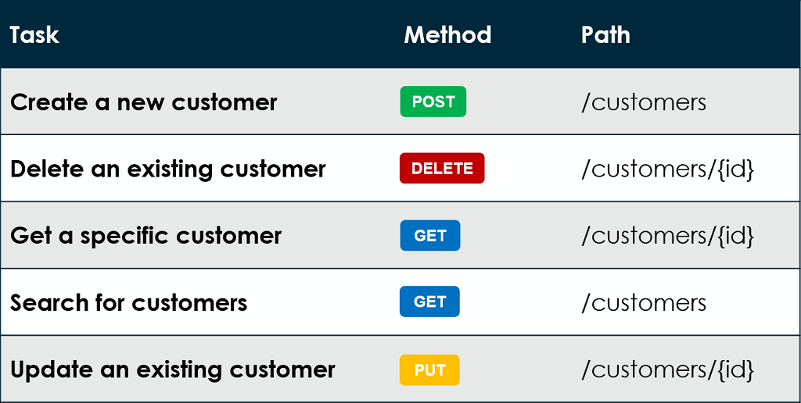

# Apa itu Back-End ? 
Back-End merupakan bagian dari aplikasi yang bertanggung jawab untuk menyediakan kebutuhan yang tak terlihat oleh pengguna (tidak berinteraksi langsung dengan pengguna), seperti bagaimana data disimpan, diolah, serta ditransaksikan secara aman. Itu semua bertujuan untuk mendukung aplikasi Front-End bekerja sesuai dengan fungsinya. Sosok yang menggeluti bidang ini disebut **Back-End Developer**.

Source : [Back-End ?](https://www.dicoding.com/blog/apa-itu-back-end/)

## API 

API atau *Aplication Programming Interface*,  adalah seperangkat protokol yang memungkinkan berbagai komponen perangkat lunak untuk berkomunikasi dan mentransfer data. Kata *Interface* dapat diartikan sebagai kontrak layanan antara dua aplikasi. Kontrak ini menjelaskan cara keduanya saling berkomunikasi dengan menggunakan permintaan (request) dan respons (response). Dokumentasi API keduanya berisi informasi cara developer menyusun permintaan dan respons tersebut.



```javascript
const express = require('express');
const app = express();

// Endpoint GET
app.get('/api/blog', (req, res) => {  
  // Contoh data response
  const data = {
    id: 1,
    title: 'Makan Besar',
    content: 'Lorem ipsum dolor sit amet, consectetur adipiscing elit. Pellentesque elementum dignissim ultricies. Fusce rhoncus ipsum tempor eros aliquam consequat. Lorem ipsum dolor sit amet' 
  };
  res.json(data);
});
```

## Bagaimana Cara API Bekerja ?
Arsitektur API biasanya dijelaskan dalam kaitannya dengan klien dan server. Aplikasi yang mengirimkan permintaan disebut sebagai klien dan aplikasi yang mengirimkan respons disebut sebagai server. Sehingga untuk contoh cuaca di atas, basis data cuaca BMKG adalah servernya sedangkan aplikasi seluler adalah kliennya. Dapat juga diartikan antara hubungan pembeli, pelayan dan koki.


## Sejarah Penggunaan API
Untuk memahami sepenuhnya peran yang dimainkan API dalam kehidupan kita, penting untuk memahami bagaimana API berevolusi. API telah ada selama beberapa dekade, dengan API web modern pertama kali terbentuk pada awal tahun 2000-an. Sejarah API sejak periode tersebut secara kasar dapat dibagi menjadi lima fase berikut:

1.  **Commercial APIs**

    Pada awal tahun 2000-an, API web muncul sebagai metode baru bagi perusahaan rintisan baru untuk tidak hanya membuat produk dan layanan tersedia secara online, tetapi juga memungkinkan mitra dan pengecer pihak ketiga untuk memperluas jangkauan platform mereka. Era API ini ditentukan oleh Salesforce, eBay, dan Amazon, dan perusahaan-perusahaan ini terus mendominasi arena permainan API saat ini.

2. **Social media APIs**

    Pergeseran lanskap API terjadi pada pertengahan tahun 2000-an, ketika sekelompok perusahaan baru—seperti Flickr, Facebook, dan Twitter—menyadari bahwa API dapat mengubah cara kita berbagi informasi satu sama lain. Meskipun API ini tidak secara lansgung terkait dengan pendapatan seperti pendahulu komersialnya, namun API ini memberikan nilai yang signifikan bagi organisasinya. Misalnya, Facebook meluncurkan API versi 1.0 pada Agustus 2006, yang memungkinkan pengembang mengakses teman, foto, acara, dan informasi profil pengguna Facebook. API ini memainkan peran penting dalam membangun Facebook sebagai salah satu jejaring sosial paling populer di dunia.

3. **Cloud APIs**
   
    Pada tahun 2006, Amazon memperkenalkan Amazon Simple Storage (S3), yang menandai satu lagi titik balik dalam sejarah API. S3 adalah layanan penyimpanan dasar di mana sumber daya dapat diakses melalui API dan CLI, dan model bayar sesuai penggunaan menyediakan cara hemat biaya bagi organisasi untuk memonetisasi aset digital dalam ekonomi online. Hanya enam bulan kemudian, Amazon merilis Amazon Elastic Compute (EC2), yang memungkinkan pengembang menggunakan API web untuk menerapkan infrastruktur yang akan menggerakkan aplikasi generasi berikutnya. Baik S3 dan EC2 terus memainkan peran penting dalam pengembangan aplikasi saat ini.

4. **APIs Untuk Aplikasi Mobile**
   
    Dunia diperkenalkan ke iPhone Apple dan Android Google pada tahun 2007. Kemampuan untuk membawa web di saku kita secara radikal mengubah cara kita hidup—dan mendorong investasi besar-besaran dalam aplikasi seluler yang didukung oleh API.

- Misalnya, Twilio meluncurkan platform API-as-a-product pada tahun 2007, yang memungkinkan pengembang melakukan dan menerima panggilan telepon dari aplikasi cloud apa pun. Instagram kemudian meluncurkan aplikasi iPhone berbagi foto pada Oktober 2010, dan memiliki satu juta pengguna hanya tiga bulan kemudian. Instagram awalnya tidak menyediakan API, tetapi mulai bekerja pada awal 2011 sebagai tanggapan atas permintaan pengguna. Perusahaan-perusahaan yang mengutamakan API ini memainkan peran penting dalam membuat cetak biru tentang cara pengiriman API hari ini.

5. **APIs Untuk Perangkat Terhubung**
   
    Sekitar tahun 2010, beberapa developer mulai menggunakan API untuk menghubungkan objek sehari-hari—seperti kamera, termostat, speaker, mikrofon, dan sensor—ke cloud. Perangkat generasi berikutnya ini, yang mencakup Fitbit, Nest, Alexa, dapat mengirim dan menerima data, konten, media, dan sumber daya digital lainnya, yang selanjutnya mengubah cara kita berinteraksi dengan dunia di sekitar kita.

## Kategori API dan Kegunaannya
Ada banyak jenis API dan cara untuk mengkategorikannya. Misalnya, Anda dapat mengkategorikan API berdasarkan siapa yang memiliki akses ke sana. Bisa juga dengan melihat cara API didesain, berikut kedua contoh kategori API yang ada :

1. **Bedasarkan Hak Akses**
   -  **Private APIs**

        Disebut juga API Inetrnal, digunakan untuk menghubungkan berbagai komponen perangkat lunak dalam satu organisasi, dan tidak tersedia untuk penggunaan pihak ketiga. Misalnya, aplikasi media sosial mungkin memiliki API pribadi yang menangani alur kerja login, API pribadi lain yang menangani umpan, dan API pribadi lain yang memfasilitasi komunikasi antar pengguna. Beberapa aplikasi mungkin menyertakan lusinan atau bahkan ratusan API pribadi.

   - **Public APIs**

       API Publik menyediakan akses publik ke data, fungsionalitas, atau layanan organisasi, yang dapat diintegrasikan oleh pengembang pihak ketiga ke dalam aplikasi mereka sendiri. Beberapa API publik tersedia secara gratis, sementara yang lain ditawarkan sebagai produk yang dapat ditagih. Misalnya, aplikasi e-niaga dapat menyertakan API pembayaran publik, seperti Stripe, untuk menangani pemrosesan pembayaran tanpa harus membangun fungsionalitas tersebut dari awal.

   - **Partner APIs**
      
       Partner API memungkinkan dua atau lebih perusahaan untuk berbagi data atau fungsionalitas untuk berkolaborasi dalam sebuah proyek. Mereka tidak tersedia untuk masyarakat umum dan karenanya memanfaatkan mekanisme otentikasi untuk memastikan mereka hanya digunakan oleh mitra resmi.

2. **Berdasarkan Arsitektur**
   -  **REST**

       REST adalah arsitektur API paling populer untuk mentransfer data melalui internet. Dalam konteks RESTful, sumber daya dapat diakses melalui titik akhir, dan operasi dilakukan pada sumber daya tersebut dengan metode HTTP standar seperti GET, POST, PUT, dan DELETE.

   - **SOAP**

      SOAP, yang merupakan singkatan dari **Simple Object Access Protocol**, menggunakan XML untuk mentransfer pesan yang sangat terstruktur antara klien dan server. SOAP sering digunakan di lingkungan perusahaan atau sistem lama, dan meskipun menyertakan fitur keamanan tingkat lanjut, SOAP bisa lebih lambat daripada arsitektur API lainnya.

   - **GraphQL**
      
      Bahasa kueri sumber terbuka yang memungkinkan klien berinteraksi dengan titik akhir API tunggal untuk mengambil data persis yang mereka butuhkan, tanpa menggabungkan beberapa permintaan secara bersamaan. Pendekatan ini mengurangi jumlah perjalanan bolak-balik antara klien dan server, yang berguna untuk aplikasi yang mungkin berjalan pada koneksi jaringan yang lambat atau tidak dapat diandalkan.

   - **Webhooks**

       Webhook digunakan untuk mengimplementasikan arsitektur berbasis peristiwa, di mana permintaan dikirim secara otomatis sebagai respons terhadap pemicu berbasis peristiwa. Misalnya, saat peristiwa tertentu terjadi di aplikasi, seperti pembayaran dilakukan, aplikasi dapat mengirimkan permintaan HTTP ke URL webhook yang telah dikonfigurasi sebelumnya dengan data peristiwa yang relevan dalam payload permintaan. Sistem yang menerima webhook kemudian dapat memproses kejadian tersebut dan mengambil tindakan yang sesuai.

   - **gRPC**
      
       RPC adalah singkatan dari Remote Procedure Call, dan API gRPC berasal dari Google. Dalam arsitektur gRPC, klien dapat memanggil server seolah-olah itu adalah objek lokal, yang memudahkan aplikasi dan sistem terdistribusi untuk berkomunikasi satu sama lain.